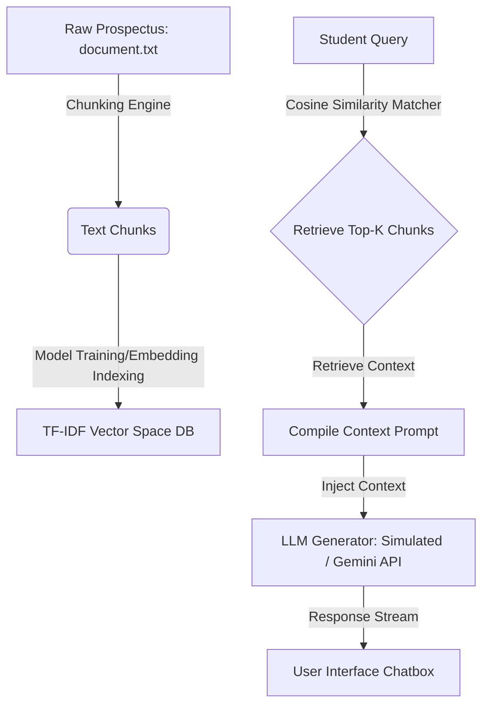

# VIT Bhopal University - Admissions RAG Chatbot Sandbox

An interactive educational single-page application demonstrating client-side **Retrieval-Augmented Generation (RAG)** architecture for university admissions counseling. 

It contains a raw knowledge document, a visual dataset explorer, and an interactive counselor chatbot widget with voice synthesis and speech-to-text dictation.

---

## 🌐 Live Demo on Render

You can access the live hosted application here:
👉 **[VIT Bhopal Admissions ChatBox on Render](https://college-chatbox-h9jl.onrender.com/)**

---

## 🚀 Running Locally

To run the RAG application:
1. Open the [index.html](file:///C:/Users/soumi/.gemini/antigravity/scratch/university-rag-chatbot/index.html) file directly in any modern web browser.
2. Alternatively, run a lightweight local dev server if desired (e.g., using Python: `python -m http.server 8000` or Node: `npx serve`).

---

## 🧠 System Architecture & Workflow

1. **Document Loading**: The system reads the raw prospectus file containing admissions, fees, hostel rooms, branches, and placement details.
2. **Text Chunking**: Configurable chunk size and overlap parameters control the sentence boundaries per document chunk.
3. **Model Indexing**: Indexing computes the term frequencies (TF) and inverse document frequencies (IDF) for all words in the corpus to represent each text chunk as a high-dimensional vector.
4. **Retrieval**: When a query is entered, its cosine similarity scores are computed against all chunk vectors. The nearest vectors are retrieved.
5. **Generation**: The context chunks are combined with system instructions. The generated prompt is sent to Google Gemini (if API key is saved) or processed by the local heuristic model.

---

## 📋 Reviewer Questions & Expected Answers Reference

Below is the structured guide of test questions a reviewer can ask the counselor, along with the expected category match and factual answers they will receive.

### Admissions & Eligibility

| # | Reviewer Question | Matching Category | Expected Answer Factual Points |
| :--- | :--- | :--- | :--- |
| 1 | **What is the minimum percentage required for B.Tech admission?** | Admissions & Eligibility | Minimum aggregate of 60% in Physics, Chemistry, and Mathematics (PCM) at the 10+2 (high school) level. |
| 2 | **Which entrance exams are accepted for B.Tech admission?** | Admissions & Eligibility | VIT Engineering Entrance Examination (VITEEE) rank or JEE Main percentile (>85% percentile). |
| 3 | **What is the application fee and deadline?** | Admissions & Eligibility | Application fee is 1,500 INR. Applications close on August 15, 2026. |
| 4 | **When does counseling and verification begin?** | Admissions & Eligibility | Official document audits and counseling sessions start on August 20, 2026. |

---

### Tuition Fees & Scholarships

| # | Reviewer Question | Matching Category | Expected Answer Factual Points |
| :--- | :--- | :--- | :--- |
| 5 | **What is the fee structure for B.Tech in Computer Science & Engineering?** | Tuition Fees & Financial Aid | 220,000 INR per year (or 110,000 INR per semester). Applies also to Data Science & AI. |
| 6 | **What is the cost of Electronics & Communication (ECE) branch?** | Tuition Fees & Financial Aid | 200,000 INR per year (or 100,000 INR per semester). Applies also to B.Tech in Robotics. |
| 7 | **Are there any scholarships available for top rankers?** | Tuition Fees & Financial Aid | Rank 1-10 in VITEEE (100% waiver); Rank 11-100 (50% waiver); >96% CBSE board score (25% tuition concession). |
| 8 | **Can I pay tuition fees in installments?** | Tuition Fees & Financial Aid | Yes, up to four interest-free installments per year for low-income candidates. |

---

### Hostel & Mess Infrastructure

| # | Reviewer Question | Matching Category | Expected Answer Factual Points |
| :--- | :--- | :--- | :--- |
| 9 | **What is the cost of a single sharing AC room in the hostel?** | Hostel & Mess Facilities | 180,000 INR per year. Includes attached washroom, Wi-Fi, laundry, and dining. |
| 10 | **What are the prices for shared rooms in the hostel?** | Hostel & Mess Facilities | Double AC (140k/yr); Double Non-AC (100k/yr); Triple Non-AC (80k/yr). |
| 11 | **Is mess food included in the hostel fee, and what is the menu?** | Hostel & Mess Facilities | Yes, mandatory 4-meal daily mess. North/South Indian vegetarian/non-vegetarian cuisines. |

---

### Academic Specializations

| # | Reviewer Question | Matching Category | Expected Answer Factual Points |
| :--- | :--- | :--- | :--- |
| 12 | **How many credits are required to graduate in B.Tech?** | Academic Branches & Specializations | Choice-Based Credit System (CBCS) requires a total of 160 credits to graduate. |
| 13 | **Can I take minor courses alongside my major?** | Academic Branches & Specializations | Yes, minor specializations (18 additional credits) are available in Fintech, Robotics, or Creative Design. |

---

### Placements & Internships

| # | Reviewer Question | Matching Category | Expected Answer Factual Points |
| :--- | :--- | :--- | :--- |
| 14 | **What is the placement percentage and average salary package?** | Placement & Internship Records | 98.6% placement rate. Average annual CTC is 8.5 Lakhs INR. Highest package was 44 Lakhs INR (Microsoft). |
| 15 | **Is an internship mandatory for engineering students?** | Placement & Internship Records | Yes, six-month internship in the 7th or 8th semester. Monthly stipends range from 20,000 INR to 80,000 INR. |
